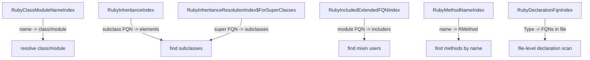

# Ruby Plugin Index Explorer

**Project:** `jetbrains-index-mcp-plugin`
**Ruby plugin loaded:** true
**Probed at:** 2026-07-14T07:55:12.501280

---

## Summary

| Index | Type | Version | Keys Found | Status |
|---|---|---|---|---|
| `RubyClassModuleNameIndex` | stub | 3 | 7289 | :white_check_mark: |
| `RubyMethodNameIndex` | stub | 2 | 10000 | :white_check_mark: |
| `RubySymbolNameIndex` | stub | 4 | 10000 | :white_check_mark: |
| `RubyConstantDeclarationFqnIndex` | stub | 4 | 118 | :white_check_mark: |
| `RubyGlobalVariableDeclarationNameIndex` | stub | 5 | 13 | :white_check_mark: |
| `RubyInheritanceIndex` | stub | 2 | 817 | :white_check_mark: |
| `RubyInheritanceResolutionIndex` | stub | 2 | 1724 | :white_check_mark: |
| `RubyInheritanceResolutionIndex$ForSuperClasses` | stub | 2 | 4691 | :white_check_mark: |
| `RubyIncludedExtendedFQNIndex` | stub | 2 | 64 | :white_check_mark: |
| `RubyAnonymousDefiningCallIndex` | stub | 3 | 908 | :white_check_mark: |
| `RubyAnonymousDeclarationSuperclassIndex` | fileBased | 1 | 16 | :white_check_mark: |
| `RubyResolutionIndex` | stub | 5 | 10000 | :white_check_mark: |
| `RubyResolutionIndex$ForCompletion` | stub | 2 | 10000 | :white_check_mark: |
| `RubyResolutionIndex$ForDocumentation` | stub | 2 | 5976 | :white_check_mark: |
| `RubyDynamicMethodsDeclarationsIndex` | stub | 2 | 129 | :white_check_mark: |
| `RubyRequireLoadIndex` | stub | 2 | 2166 | :white_check_mark: |
| `RubyAllInstanceVariablesIndex` | stub | 3 | 2241 | :white_check_mark: |
| `RubyDeclarationFqnIndex` | fileBased | 4 | 0 | :x: Probe failed: class org.jetbrains.plugins.ruby.ruby.lang.psi |
| `RubyDeclarationSuperclassIndex` | fileBased | 4 | 20 | :white_check_mark: |
| `RubyDeclarationHierarchyIndex` | fileBased | 3 | 20 | :white_check_mark: |

## Detailed Index Probe Results

### Class/Module Resolution

### RubyClassModuleNameIndex

| Property | Value |
|---|---|
| **Type** | `stub` |
| **Key** | `String (simple name)` |
| **Value** | `RElementWithFQN (class/module PSI)` |
| **Helper methods** | `getInstance()`<br>`getKey()`<br>`getVersion()`<br>`find(project, name, scope) -> Collection<RElementWithFQN>`<br>`findOne(project, name, scope, predicate) -> RElementWithFQN` |
| **Version** | `3` |

**All keys count:** 7289

**Sample keys (20 shown):**

```
  InvalidProgressError
  Null
  Tty
  MOLECULE_PATTERN
  ANSI_SGR_PATTERN
  TIME_MOCKING_LIBRARY_METHODS
  Timer
  Rate
  NonTty
  DEFAULT_TITLE
  Title
  DEFAULT_OUTPUT_STREAM
  ARITY_ERROR_MESSAGE
  Enumerator
  Refinements
  MOLECULES
  Molecule
  BAR_MOLECULES
  Projector
  DEFAULT_PROJECTOR
```

**Sample lookup:** key=`InvalidProgressError` → ProbeResult(index=IndexDescriptor(className=org.jetbrains.plugins.ruby.ruby.lang.psi.indexes.RubyClassModuleNameIndex, simpleName=RubyClassModuleNameIndex, type=stub, keyType=String (simple name), valueType=RElementWithFQN (class/module PSI), innerClasses=[], staticMethods=[getInstance(), getKey(), getVersion(), find(project, name, scope) -> Collection<RElementWithFQN>, findOne(project, name, scope, predicate) -> RElementWithFQN]), version=3, keyCount=7289, sampleKeys=[InvalidProgressError, Null, Tty, MOLECULE_PATTERN, ANSI_SGR_PATTERN, TIME_MOCKING_LIBRARY_METHODS, Timer, Rate, NonTty, DEFAULT_TITLE, Title, DEFAULT_OUTPUT_STREAM, ARITY_ERROR_MESSAGE, Enumerator, Refinements, MOLECULES, Molecule, BAR_MOLECULES, Projector, DEFAULT_PROJECTOR], sampleKeyValue=count=0, first=null: 'null', indexedFileCount=null, errors=[]).sampleKeyValue

### RubyMethodNameIndex

| Property | Value |
|---|---|
| **Type** | `stub` |
| **Key** | `String (method name, e.g., 'find', 'admin?', 'save!')` |
| **Value** | `RMethod (method PSI element)` |
| **Helper methods** | `getInstance()`<br>`getKey()` |
| **Version** | `2` |

**All keys count:** 10000

**Sample keys (20 shown):**

```
  non_bar_molecules
  molecules
  bar_molecule_placeholder_length
  bar_molecules
  displayable_length
  unmocked_time_method
  elapsed_whole_seconds
  reset?
  restart
  divide_seconds
  base_rate
  scaled_rate
  rate_of_change
  rate_of_change_with_precision
  refresh_with_format_change
  last_update_length
  percentage
  justified_percentage_with_precision
  justified_percentage
  percentage_with_precision
```

**Sample lookup:** key=`non_bar_molecules` → ProbeResult(index=IndexDescriptor(className=org.jetbrains.plugins.ruby.ruby.lang.psi.indexes.RubyMethodNameIndex, simpleName=RubyMethodNameIndex, type=stub, keyType=String (method name, e.g., 'find', 'admin?', 'save!'), valueType=RMethod (method PSI element), innerClasses=[], staticMethods=[getInstance(), getKey()]), version=2, keyCount=10000, sampleKeys=[non_bar_molecules, molecules, bar_molecule_placeholder_length, bar_molecules, displayable_length, unmocked_time_method, elapsed_whole_seconds, reset?, restart, divide_seconds, base_rate, scaled_rate, rate_of_change, rate_of_change_with_precision, refresh_with_format_change, last_update_length, percentage, justified_percentage_with_precision, justified_percentage, percentage_with_precision], sampleKeyValue=no getElements method found, indexedFileCount=null, errors=[]).sampleKeyValue

### RubySymbolNameIndex

| Property | Value |
|---|---|
| **Type** | `stub` |
| **Key** | `String (symbol name, simple)` |
| **Value** | `RPsiElement (general PSI element)` |
| **Helper methods** | `getInstance()`<br>`getKey()`<br>`getVersion()` |
| **Version** | `4` |

**All keys count:** 10000

**Sample keys (20 shown):**

```
  InvalidProgressError
  Null
  Tty
  MOLECULE_PATTERN
  non_bar_molecules
  ANSI_SGR_PATTERN
  molecules
  bar_molecule_placeholder_length
  bar_molecules
  displayable_length
  unmocked_time_method
  TIME_MOCKING_LIBRARY_METHODS
  restart
  divide_seconds
  elapsed_whole_seconds
  reset?
  Timer
  Rate
  rate_scale
  rate_scale=
```

**Sample lookup:** key=`InvalidProgressError` → ProbeResult(index=IndexDescriptor(className=org.jetbrains.plugins.ruby.ruby.lang.psi.indexes.RubySymbolNameIndex, simpleName=RubySymbolNameIndex, type=stub, keyType=String (symbol name, simple), valueType=RPsiElement (general PSI element), innerClasses=[], staticMethods=[getInstance(), getKey(), getVersion()]), version=4, keyCount=10000, sampleKeys=[InvalidProgressError, Null, Tty, MOLECULE_PATTERN, non_bar_molecules, ANSI_SGR_PATTERN, molecules, bar_molecule_placeholder_length, bar_molecules, displayable_length, unmocked_time_method, TIME_MOCKING_LIBRARY_METHODS, restart, divide_seconds, elapsed_whole_seconds, reset?, Timer, Rate, rate_scale, rate_scale=], sampleKeyValue=count=0, first=null: 'null', indexedFileCount=null, errors=[]).sampleKeyValue

### RubyConstantDeclarationFqnIndex

| Property | Value |
|---|---|
| **Type** | `stub` |
| **Key** | `String (FQN, e.g. 'MyApp::CONST')` |
| **Value** | `RConstant (constant PSI element)` |
| **Helper methods** | `getKey()`<br>`getVersion()` |
| **Version** | `4` |

**All keys count:** 118

**Sample keys (20 shown):**

```
  Rake::RDocTask
  RDoc::Text::TO_HTML_CHARACTERS
  RDoc::RDoc::GENERATORS
  RDoc::KNOWN_CLASSES
  RDoc::CrossReference::CLASS_REGEXP_STR
  RDoc::CrossReference::ALL_CROSSREF_REGEXP
  RDoc::CrossReference::CROSSREF_REGEXP
  RDoc::CrossReference::METHOD_REGEXP_STR
  RDoc::CONSTANT_MODIFIERS
  RDoc::DOT_DOC_FILENAME
  RDoc::GENERAL_MODIFIERS
  RDoc::ATTR_MODIFIERS
  RDoc::CLASS_MODIFIERS
  RDoc::VISIBILITIES
  RDoc::VERSION
  RDoc::METHOD_MODIFIERS
  RDoc::Options::DEPRECATED
  RDoc::Options::Template
  RDoc::Text::MARKUP_FORMAT
  RDoc::Encoding::HEADER_REGEXP
```

**Sample lookup:** key=`Rake::RDocTask` → ProbeResult(index=IndexDescriptor(className=org.jetbrains.plugins.ruby.ruby.lang.psi.indexes.RubyConstantDeclarationFqnIndex, simpleName=RubyConstantDeclarationFqnIndex, type=stub, keyType=String (FQN, e.g. 'MyApp::CONST'), valueType=RConstant (constant PSI element), innerClasses=[], staticMethods=[getKey(), getVersion()]), version=4, keyCount=118, sampleKeys=[Rake::RDocTask, RDoc::Text::TO_HTML_CHARACTERS, RDoc::RDoc::GENERATORS, RDoc::KNOWN_CLASSES, RDoc::CrossReference::CLASS_REGEXP_STR, RDoc::CrossReference::ALL_CROSSREF_REGEXP, RDoc::CrossReference::CROSSREF_REGEXP, RDoc::CrossReference::METHOD_REGEXP_STR, RDoc::CONSTANT_MODIFIERS, RDoc::DOT_DOC_FILENAME, RDoc::GENERAL_MODIFIERS, RDoc::ATTR_MODIFIERS, RDoc::CLASS_MODIFIERS, RDoc::VISIBILITIES, RDoc::VERSION, RDoc::METHOD_MODIFIERS, RDoc::Options::DEPRECATED, RDoc::Options::Template, RDoc::Text::MARKUP_FORMAT, RDoc::Encoding::HEADER_REGEXP], sampleKeyValue=lookup failed: argument type mismatch, indexedFileCount=null, errors=[]).sampleKeyValue

### RubyGlobalVariableDeclarationNameIndex

| Property | Value |
|---|---|
| **Type** | `stub` |
| **Key** | `String (variable name, e.g. '$redis', '$logger')` |
| **Value** | `RPsiElement (global variable PSI)` |
| **Helper methods** | `getInstance()`<br>`getKey()`<br>`getVersion()` |
| **Version** | `5` |

**All keys count:** 13

**Sample keys (13 shown):**

```
  0
  VERBOSE
  TOKEN_DEBUG
  DEBUG_RDOC
  rdoc_rakefile
  example
  quadratic_str
  quad
  RUBY_SOURCE_DIR
  GEN_DEBUG
  RUBY_STUB_TEST
  RUBY_SOURCE_VERSION
  DIRECTORY
```

**Sample lookup:** key=`0` → ProbeResult(index=IndexDescriptor(className=org.jetbrains.plugins.ruby.ruby.lang.psi.indexes.RubyGlobalVariableDeclarationNameIndex, simpleName=RubyGlobalVariableDeclarationNameIndex, type=stub, keyType=String (variable name, e.g. '$redis', '$logger'), valueType=RPsiElement (global variable PSI), innerClasses=[], staticMethods=[getInstance(), getKey(), getVersion()]), version=5, keyCount=13, sampleKeys=[0, VERBOSE, TOKEN_DEBUG, DEBUG_RDOC, rdoc_rakefile, example, quadratic_str, quad, RUBY_SOURCE_DIR, GEN_DEBUG, RUBY_STUB_TEST, RUBY_SOURCE_VERSION, DIRECTORY], sampleKeyValue=count=1, first=RGlobalVariableImpl: 'RGlobalVariableImpl(Ruby:GLOBAL)', indexedFileCount=null, errors=[]).sampleKeyValue

---

### Inheritance / Type Hierarchy

### RubyInheritanceIndex

| Property | Value |
|---|---|
| **Type** | `stub` |
| **Key** | `String (FQN of subclass, e.g. 'MyClass')` |
| **Value** | `RPsiElement (the inheriting element)` |
| **Helper methods** | `getInstance()`<br>`getKey()` |
| **Version** | `2` |

**All keys count:** 817

**Sample keys (20 shown):**

```
  Thor
  Numeric
  Severity
  Constants
  Kernel
  PP
  OpenStruct
  JSONError
  modul
  DBM
  PStore
  Period
  MonitorMixin
  Gauntlet
  Option
  Inline
  $$ANON$CNDU3NTU5NDc0$$<Struct
  DynamicPredicate
  DefaultImplementations
  Deprecated
```

**Sample lookup:** key=`Thor` → ProbeResult(index=IndexDescriptor(className=org.jetbrains.plugins.ruby.ruby.lang.psi.indexes.RubyInheritanceIndex, simpleName=RubyInheritanceIndex, type=stub, keyType=String (FQN of subclass, e.g. 'MyClass'), valueType=RPsiElement (the inheriting element), innerClasses=[], staticMethods=[getInstance(), getKey()]), version=2, keyCount=817, sampleKeys=[Thor, Numeric, Severity, Constants, Kernel, PP, OpenStruct, JSONError, modul, DBM, PStore, Period, MonitorMixin, Gauntlet, Option, Inline, $$ANON$CNDU3NTU5NDc0$$<Struct, DynamicPredicate, DefaultImplementations, Deprecated], sampleKeyValue=lookup failed: argument type mismatch, indexedFileCount=null, errors=[]).sampleKeyValue

### RubyInheritanceResolutionIndex

| Property | Value |
|---|---|
| **Type** | `stub` |
| **Key** | `String (FQN for resolution lookup)` |
| **Value** | `RPsiElement` |
| **Helper methods** | `getKey()`<br>`getVersion()` |
| **Version** | `2` |

**All keys count:** 1724

**Sample keys (20 shown):**

```
  RSpec::Core::ExampleGroup
  Object::RSpec::Core::ExampleGroup
  Object::Array
  Array
  Net::HTTPError
  Net::HTTPFatalError
  Net::HTTPRetriableError
  Object::Net::HTTPError
  Object::Net::HTTPClientException
  Object::Net::HTTPFatalError
  Object::Net::HTTPRetriableError
  Net::HTTPClientException
  Net::HTTPResponse
  Object::Net::HTTPResponse
  Net::HTTPGenericRequest
  Object::Net::HTTPGenericRequest
  URI::MailTo
  Object::URI::MailTo
  Object::URI::RFC2396_Parser
  URI::RFC2396_Parser
```

**Sample lookup:** key=`RSpec::Core::ExampleGroup` → ProbeResult(index=IndexDescriptor(className=org.jetbrains.plugins.ruby.ruby.lang.psi.indexes.RubyInheritanceResolutionIndex, simpleName=RubyInheritanceResolutionIndex, type=stub, keyType=String (FQN for resolution lookup), valueType=RPsiElement, innerClasses=[], staticMethods=[getKey(), getVersion()]), version=2, keyCount=1724, sampleKeys=[RSpec::Core::ExampleGroup, Object::RSpec::Core::ExampleGroup, Object::Array, Array, Net::HTTPError, Net::HTTPFatalError, Net::HTTPRetriableError, Object::Net::HTTPError, Object::Net::HTTPClientException, Object::Net::HTTPFatalError, Object::Net::HTTPRetriableError, Net::HTTPClientException, Net::HTTPResponse, Object::Net::HTTPResponse, Net::HTTPGenericRequest, Object::Net::HTTPGenericRequest, URI::MailTo, Object::URI::MailTo, Object::URI::RFC2396_Parser, URI::RFC2396_Parser], sampleKeyValue=lookup failed: argument type mismatch, indexedFileCount=null, errors=[]).sampleKeyValue

### RubyInheritanceResolutionIndex$ForSuperClasses

| Property | Value |
|---|---|
| **Type** | `stub` |
| **Key** | `String (FQN of superclass)` |
| **Value** | `RPsiElement (subclass elements)` |
| **Helper methods** | `getKey()`<br>`getVersion()` |
| **Version** | `2` |

**All keys count:** 4691

**Sample keys (20 shown):**

```
  Object::Sequel::SQL::VirtualRow
  Sequel::SQL::VirtualRow
  Float
  Object::Float
  Complex
  Object::Complex
  Integer
  Object::Integer
  Object::Rational
  Rational
  Object::Net::HTTPRequest
  Net::HTTPRequest
  Net::HTTP::Get
  Net::HTTP::Proppatch
  Object::Net::HTTP::Get
  Object::Net::HTTP::Propfind
  Object::Net::HTTP::Unlock
  Object::Net::HTTP::Proppatch
  Net::HTTP::Copy
  Net::HTTP::Unlock
```

**Sample lookup:** key=`Object::Sequel::SQL::VirtualRow` → ProbeResult(index=IndexDescriptor(className=org.jetbrains.plugins.ruby.ruby.lang.psi.indexes.RubyInheritanceResolutionIndex$ForSuperClasses, simpleName=RubyInheritanceResolutionIndex$ForSuperClasses, type=stub, keyType=String (FQN of superclass), valueType=RPsiElement (subclass elements), innerClasses=[], staticMethods=[getKey(), getVersion()]), version=2, keyCount=4691, sampleKeys=[Object::Sequel::SQL::VirtualRow, Sequel::SQL::VirtualRow, Float, Object::Float, Complex, Object::Complex, Integer, Object::Integer, Object::Rational, Rational, Object::Net::HTTPRequest, Net::HTTPRequest, Net::HTTP::Get, Net::HTTP::Proppatch, Object::Net::HTTP::Get, Object::Net::HTTP::Propfind, Object::Net::HTTP::Unlock, Object::Net::HTTP::Proppatch, Net::HTTP::Copy, Net::HTTP::Unlock], sampleKeyValue=lookup failed: argument type mismatch, indexedFileCount=null, errors=[]).sampleKeyValue

### RubyIncludedExtendedFQNIndex

| Property | Value |
|---|---|
| **Type** | `stub` |
| **Key** | `String (FQN of included/extended module)` |
| **Value** | `RPsiElement (elements that include/extend it)` |
| **Helper methods** | `getKey()` |
| **Version** | `2` |

**All keys count:** 64

**Sample keys (20 shown):**

```
  Object::Bundler::Thor::Base::$$HOOK$$.included
  Bundler::Thor::Base::$$HOOK$$.included
  Object::Bundler::Thor::Invocation::$$HOOK$$.included
  Bundler::Thor::Invocation::$$HOOK$$.included
  Bundler::Thor::Actions::$$HOOK$$.included
  Object::Bundler::Thor::Actions::$$HOOK$$.included
  Dry::CLI::Registry::$$HOOK$$.extended
  Object::Dry::CLI::Registry::$$HOOK$$.extended
  Object::Listen::FSM::$$HOOK$$.included
  Listen::FSM::$$HOOK$$.included
  Regexp::Expression::Shared::$$HOOK$$.included
  Object::Regexp::Expression::Shared::$$HOOK$$.included
  Object::Pry::Testable::$$HOOK$$.included
  Pry::Testable::$$HOOK$$.included
  RSpec::Mocks::ExampleMethods::$$HOOK$$.extended
  Object::RSpec::Mocks::ExampleMethods::$$HOOK$$.extended
  Sequel::JDBC::Oracle::DatabaseMethods::$$HOOK$$.extended
  Object::Sequel::JDBC::Oracle::DatabaseMethods::$$HOOK$$.extended
  Sequel::Postgres::EnumDatabaseMethods::$$HOOK$$.extended
  Object::Sequel::Postgres::EnumDatabaseMethods::$$HOOK$$.extended
```

**Sample lookup:** key=`Object::Bundler::Thor::Base::$$HOOK$$.included` → ProbeResult(index=IndexDescriptor(className=org.jetbrains.plugins.ruby.ruby.lang.psi.indexes.RubyIncludedExtendedFQNIndex, simpleName=RubyIncludedExtendedFQNIndex, type=stub, keyType=String (FQN of included/extended module), valueType=RPsiElement (elements that include/extend it), innerClasses=[], staticMethods=[getKey()]), version=2, keyCount=64, sampleKeys=[Object::Bundler::Thor::Base::$$HOOK$$.included, Bundler::Thor::Base::$$HOOK$$.included, Object::Bundler::Thor::Invocation::$$HOOK$$.included, Bundler::Thor::Invocation::$$HOOK$$.included, Bundler::Thor::Actions::$$HOOK$$.included, Object::Bundler::Thor::Actions::$$HOOK$$.included, Dry::CLI::Registry::$$HOOK$$.extended, Object::Dry::CLI::Registry::$$HOOK$$.extended, Object::Listen::FSM::$$HOOK$$.included, Listen::FSM::$$HOOK$$.included, Regexp::Expression::Shared::$$HOOK$$.included, Object::Regexp::Expression::Shared::$$HOOK$$.included, Object::Pry::Testable::$$HOOK$$.included, Pry::Testable::$$HOOK$$.included, RSpec::Mocks::ExampleMethods::$$HOOK$$.extended, Object::RSpec::Mocks::ExampleMethods::$$HOOK$$.extended, Sequel::JDBC::Oracle::DatabaseMethods::$$HOOK$$.extended, Object::Sequel::JDBC::Oracle::DatabaseMethods::$$HOOK$$.extended, Sequel::Postgres::EnumDatabaseMethods::$$HOOK$$.extended, Object::Sequel::Postgres::EnumDatabaseMethods::$$HOOK$$.extended], sampleKeyValue=lookup failed: argument type mismatch, indexedFileCount=null, errors=[]).sampleKeyValue

### RubyAnonymousDefiningCallIndex

| Property | Value |
|---|---|
| **Type** | `stub` |
| **Key** | `String (FQN of anonymous definition context)` |
| **Value** | `RPossibleCall (anonymous call element)` |
| **Helper methods** | `getInstance()`<br>`getKey()`<br>`getVersion()` |
| **Version** | `3` |

**All keys count:** 908

**Sample keys (20 shown):**

```
  $$ANON$CMjMzMzMyNzQ2$$
  JSON::$$SINGLETON$$.klass
  OpenStruct.nil
  $$ANON$CMTc0NzQ3NjQ5MA$$
  $$ANON$CMTAwOTI3ODk4Ng$$
  $$ANON$CLTUzMzI0Njg5NQ$$<Dry!!CLI!!Command
  Dry::CLI::Registry::$$ANON$CLTY5NjY2MjQ2NA$$
  Dry::CLI::Command::$$ANON$CLTkzMzY0MDY0MA$$
  Dry::CLI::Command.base
  $$ANON$CNDU3NTU5NDc0$$<Struct
  $$ANON$CLTgwOTU2NDEyMQ$$<Struct
  $$ANON$MLTE3NzM2NjY0OTg$$
  $$ANON$MNTUxMDI2NDk0$$
  $$ANON$CLTE2NzI1NDIxNjk$$<Struct
  $$ANON$CMjE5OTg3MjM5$$<Struct
  $$ANON$MLTE1NTY2MTEyNjY$$
  $$ANON$CLTkzMDkwOTE1$$<Struct
  $$ANON$CLTExMDE2MzkyOQ$$<Struct
  $$ANON$CNzAyMDQ2MjE4$$
  $$ANON$CNDY0OTg4OTM0$$<Struct
```

**Sample lookup:** key=`$$ANON$CMjMzMzMyNzQ2$$` → ProbeResult(index=IndexDescriptor(className=org.jetbrains.plugins.ruby.ruby.lang.psi.indexes.RubyAnonymousDefiningCallIndex, simpleName=RubyAnonymousDefiningCallIndex, type=stub, keyType=String (FQN of anonymous definition context), valueType=RPossibleCall (anonymous call element), innerClasses=[], staticMethods=[getInstance(), getKey(), getVersion()]), version=3, keyCount=908, sampleKeys=[$$ANON$CMjMzMzMyNzQ2$$, JSON::$$SINGLETON$$.klass, OpenStruct.nil, $$ANON$CMTc0NzQ3NjQ5MA$$, $$ANON$CMTAwOTI3ODk4Ng$$, $$ANON$CLTUzMzI0Njg5NQ$$<Dry!!CLI!!Command, Dry::CLI::Registry::$$ANON$CLTY5NjY2MjQ2NA$$, Dry::CLI::Command::$$ANON$CLTkzMzY0MDY0MA$$, Dry::CLI::Command.base, $$ANON$CNDU3NTU5NDc0$$<Struct, $$ANON$CLTgwOTU2NDEyMQ$$<Struct, $$ANON$MLTE3NzM2NjY0OTg$$, $$ANON$MNTUxMDI2NDk0$$, $$ANON$CLTE2NzI1NDIxNjk$$<Struct, $$ANON$CMjE5OTg3MjM5$$<Struct, $$ANON$MLTE1NTY2MTEyNjY$$, $$ANON$CLTkzMDkwOTE1$$<Struct, $$ANON$CLTExMDE2MzkyOQ$$<Struct, $$ANON$CNzAyMDQ2MjE4$$, $$ANON$CNDY0OTg4OTM0$$<Struct], sampleKeyValue=lookup failed: argument type mismatch, indexedFileCount=null, errors=[]).sampleKeyValue

### RubyAnonymousDeclarationSuperclassIndex

| Property | Value |
|---|---|
| **Type** | `fileBased` |
| **Key** | `String` |
| **Value** | `unknown` |
| **Version** | `1` |

**All keys count:** 16

**Sample keys (16 shown):**

```
  $$ANON$CLTIwNzUxOTUzNTM$$<Struct
  $$ANON$CLTEzNTQzNTE1NTk$$<Struct
  $$ANON$CLTIwMTMzMjkzNjk$$<Struct
  $$ANON$CLTEwNTM4NzkyMA$$<Struct
  $$ANON$CLTE0NTc1ODQwODk$$<Struct
  $$ANON$CLTMzODUyMDQzMw$$<Struct
  $$ANON$CLTIwNTMxNzUyNTc$$<Struct
  $$ANON$CLTMwNDU5MTE4MQ$$<Struct
  $$ANON$CLTIwNTIxMjY2ODE$$<Struct
  $$ANON$CLTEzNjQ4MzczMTk$$<Struct
  $$ANON$CLTk4MDQ4MjAwOQ$$<Struct
  $$ANON$CLTEzNzkzODE1ODE$$<Struct
  $$ANON$CLTIwNjE1NjM4NjU$$<Struct
  $$ANON$CLTc4MTI0OTQ0$$<Struct
  $$ANON$CLTE2MjMyNTkwOTc$$<Struct
  $$ANON$CLTU3MTMwNDMwNQ$$<Struct
```

---

### General Resolution

### RubyResolutionIndex

| Property | Value |
|---|---|
| **Type** | `stub` |
| **Key** | `String (FQN for general resolution)` |
| **Value** | `RPsiElement` |
| **Helper methods** | `getKey()`<br>`getVersion()` |
| **Version** | `5` |

**All keys count:** 10000

**Sample keys (20 shown):**

```
  ProgressBar::InvalidProgressError
  Object::ProgressBar::InvalidProgressError
  Object::ProgressBar::Outputs::Null.default_format
  Object::ProgressBar::Outputs::Null
  Object::ProgressBar::Outputs::Null.refresh
  ProgressBar::Outputs::Null
  Object::ProgressBar::Outputs::Null.clear
  Object::ProgressBar::Outputs::Null.resolve_format
  Object::ProgressBar::Outputs::Null.log
  ProgressBar::Outputs::Null.resolve_format
  Object::ProgressBar::Outputs::Null.clear_string
  ProgressBar::Outputs::Null.default_format
  Object::ProgressBar::Outputs::Null.bar_update_string
  ProgressBar::Outputs::Null.bar_update_string
  ProgressBar::Outputs::Null.clear_string
  ProgressBar::Outputs::Null.clear
  ProgressBar::Outputs::Null.eol
  ProgressBar::Outputs::Null.log
  ProgressBar::Outputs::Null.refresh
  Object::ProgressBar::Outputs::Null.refresh_with_format_change
```

**Sample lookup:** key=`ProgressBar::InvalidProgressError` → ProbeResult(index=IndexDescriptor(className=org.jetbrains.plugins.ruby.ruby.lang.psi.indexes.RubyResolutionIndex, simpleName=RubyResolutionIndex, type=stub, keyType=String (FQN for general resolution), valueType=RPsiElement, innerClasses=[], staticMethods=[getKey(), getVersion()]), version=5, keyCount=10000, sampleKeys=[ProgressBar::InvalidProgressError, Object::ProgressBar::InvalidProgressError, Object::ProgressBar::Outputs::Null.default_format, Object::ProgressBar::Outputs::Null, Object::ProgressBar::Outputs::Null.refresh, ProgressBar::Outputs::Null, Object::ProgressBar::Outputs::Null.clear, Object::ProgressBar::Outputs::Null.resolve_format, Object::ProgressBar::Outputs::Null.log, ProgressBar::Outputs::Null.resolve_format, Object::ProgressBar::Outputs::Null.clear_string, ProgressBar::Outputs::Null.default_format, Object::ProgressBar::Outputs::Null.bar_update_string, ProgressBar::Outputs::Null.bar_update_string, ProgressBar::Outputs::Null.clear_string, ProgressBar::Outputs::Null.clear, ProgressBar::Outputs::Null.eol, ProgressBar::Outputs::Null.log, ProgressBar::Outputs::Null.refresh, Object::ProgressBar::Outputs::Null.refresh_with_format_change], sampleKeyValue=lookup failed: argument type mismatch, indexedFileCount=null, errors=[]).sampleKeyValue

### RubyResolutionIndex$ForCompletion

| Property | Value |
|---|---|
| **Type** | `stub` |
| **Key** | `String (FQN for completion)` |
| **Value** | `RPsiElement` |
| **Helper methods** | `getKey()` |
| **Version** | `2` |

**All keys count:** 10000

**Sample keys (20 shown):**

```
  Object::ProgressBar::Outputs::Null
  ProgressBar::Outputs::Null
  ProgressBar::Format::Formatter::$$SINGLETON$$
  Object::ProgressBar::Format::Formatter::$$SINGLETON$$
  ProgressBar::Outputs::Tty
  Object::ProgressBar::Outputs::Tty
  Object::ProgressBar::Format::String
  ProgressBar::Format::String
  ProgressBar::Time
  Object::ProgressBar::Time
  ProgressBar::Timer
  Object::ProgressBar::Timer
  ProgressBar::Components::Rate
  Object::ProgressBar::Components::Rate
  ProgressBar::Outputs::NonTty
  Object::ProgressBar::Outputs::NonTty
  Object::ProgressBar::Components::Title
  ProgressBar::Components::Title
  Object::ProgressBar
  ProgressBar
```

**Sample lookup:** key=`Object::ProgressBar::Outputs::Null` → ProbeResult(index=IndexDescriptor(className=org.jetbrains.plugins.ruby.ruby.lang.psi.indexes.RubyResolutionIndex$ForCompletion, simpleName=RubyResolutionIndex$ForCompletion, type=stub, keyType=String (FQN for completion), valueType=RPsiElement, innerClasses=[], staticMethods=[getKey()]), version=2, keyCount=10000, sampleKeys=[Object::ProgressBar::Outputs::Null, ProgressBar::Outputs::Null, ProgressBar::Format::Formatter::$$SINGLETON$$, Object::ProgressBar::Format::Formatter::$$SINGLETON$$, ProgressBar::Outputs::Tty, Object::ProgressBar::Outputs::Tty, Object::ProgressBar::Format::String, ProgressBar::Format::String, ProgressBar::Time, Object::ProgressBar::Time, ProgressBar::Timer, Object::ProgressBar::Timer, ProgressBar::Components::Rate, Object::ProgressBar::Components::Rate, ProgressBar::Outputs::NonTty, Object::ProgressBar::Outputs::NonTty, Object::ProgressBar::Components::Title, ProgressBar::Components::Title, Object::ProgressBar, ProgressBar], sampleKeyValue=lookup failed: argument type mismatch, indexedFileCount=null, errors=[]).sampleKeyValue

### RubyResolutionIndex$ForDocumentation

| Property | Value |
|---|---|
| **Type** | `stub` |
| **Key** | `String (FQN for documentation)` |
| **Value** | `RPsiElement` |
| **Helper methods** | `getKey()` |
| **Version** | `2` |

**All keys count:** 5976

**Sample keys (20 shown):**

```
  ProgressBar::InvalidProgressError
  ProgressBar::Outputs::Null
  ProgressBar::Format::Formatter
  ProgressBar::Outputs::Tty
  ProgressBar::Format::String
  ProgressBar::Time
  ProgressBar::Timer
  ProgressBar::Components::Rate
  ProgressBar::Outputs::NonTty
  ProgressBar::Components::Title
  ProgressBar::Components::Percentage
  ProgressBar::Output
  ProgressBar::Refinements
  ProgressBar::Refinements::Enumerator
  ProgressBar::Format::Molecule
  ProgressBar::Projector
  ProgressBar::Components::Bar
  ProgressBar::Throttle
  ProgressBar::Projectors::SmoothedAverage
  ProgressBar::Projectors
```

**Sample lookup:** key=`ProgressBar::InvalidProgressError` → ProbeResult(index=IndexDescriptor(className=org.jetbrains.plugins.ruby.ruby.lang.psi.indexes.RubyResolutionIndex$ForDocumentation, simpleName=RubyResolutionIndex$ForDocumentation, type=stub, keyType=String (FQN for documentation), valueType=RPsiElement, innerClasses=[], staticMethods=[getKey()]), version=2, keyCount=5976, sampleKeys=[ProgressBar::InvalidProgressError, ProgressBar::Outputs::Null, ProgressBar::Format::Formatter, ProgressBar::Outputs::Tty, ProgressBar::Format::String, ProgressBar::Time, ProgressBar::Timer, ProgressBar::Components::Rate, ProgressBar::Outputs::NonTty, ProgressBar::Components::Title, ProgressBar::Components::Percentage, ProgressBar::Output, ProgressBar::Refinements, ProgressBar::Refinements::Enumerator, ProgressBar::Format::Molecule, ProgressBar::Projector, ProgressBar::Components::Bar, ProgressBar::Throttle, ProgressBar::Projectors::SmoothedAverage, ProgressBar::Projectors], sampleKeyValue=lookup failed: argument type mismatch, indexedFileCount=null, errors=[]).sampleKeyValue

### RubyDynamicMethodsDeclarationsIndex

| Property | Value |
|---|---|
| **Type** | `stub` |
| **Key** | `String (FQN of class/module with dynamic methods)` |
| **Value** | `RPsiElement (dynamic method declarations)` |
| **Helper methods** | `getInstance()`<br>`getKey()` |
| **Version** | `2` |

**All keys count:** 129

**Sample keys (20 shown):**

```
  Matchers
  Bundler::Thor::$$SINGLETON$$
  Bundler::Fetcher::CompactIndex
  Bundler::BundlerError
  Bundler::Runtime
  Bundler::FeatureFlag
  Bundler::CurrentRuby
  Gem::Commands::ExecCommand
  Gem::Commands::CertCommand
  Kernel
  Gem::Security::TrustDir
  Gem::Security::Signer
  Gem::Security::Policy
  Gem::Request
  Gem::Deprecate::$$ANON$CNjcwMzc5NTU$$
  Gem::Deprecate::$$ANON$CMTE1OTY1NDE0Nw$$
  Gem::Deprecate::$$ANON$CLTg4MDg3NDc0OQ$$
  Gem::Security
  RSpec::Matchers::BuiltIn::Be
  Dry::CLI::Inline
```

**Sample lookup:** key=`Matchers` → ProbeResult(index=IndexDescriptor(className=org.jetbrains.plugins.ruby.ruby.lang.psi.indexes.RubyDynamicMethodsDeclarationsIndex, simpleName=RubyDynamicMethodsDeclarationsIndex, type=stub, keyType=String (FQN of class/module with dynamic methods), valueType=RPsiElement (dynamic method declarations), innerClasses=[], staticMethods=[getInstance(), getKey()]), version=2, keyCount=129, sampleKeys=[Matchers, Bundler::Thor::$$SINGLETON$$, Bundler::Fetcher::CompactIndex, Bundler::BundlerError, Bundler::Runtime, Bundler::FeatureFlag, Bundler::CurrentRuby, Gem::Commands::ExecCommand, Gem::Commands::CertCommand, Kernel, Gem::Security::TrustDir, Gem::Security::Signer, Gem::Security::Policy, Gem::Request, Gem::Deprecate::$$ANON$CNjcwMzc5NTU$$, Gem::Deprecate::$$ANON$CMTE1OTY1NDE0Nw$$, Gem::Deprecate::$$ANON$CLTg4MDg3NDc0OQ$$, Gem::Security, RSpec::Matchers::BuiltIn::Be, Dry::CLI::Inline], sampleKeyValue=lookup failed: argument type mismatch, indexedFileCount=null, errors=[]).sampleKeyValue

---

### Require / Variable Tracking

### RubyRequireLoadIndex

| Property | Value |
|---|---|
| **Type** | `stub` |
| **Key** | `String (require/load path, e.g. 'active_support/core_ext')` |
| **Value** | `RPossibleCall (the require/load call PSI)` |
| **Helper methods** | `getInstance()`<br>`getKey()` |
| **Version** | `2` |

**All keys count:** 2166

**Sample keys (30 shown):**

```
  default
  slop
  result
  variable
  matchers
  hunk
  :Output
  string
  opensearch
  commands
  singleton
  listen
  index
  serialized_data
  notifier
  file_name
  yard
  sha1
  color_printer
  inspector
  show_doc
  cd
  ls
  load
  show_source
  edit
  exit
  whereami
  proc
  opts
```

**Sample lookup:** key=`default` → ProbeResult(index=IndexDescriptor(className=org.jetbrains.plugins.ruby.ruby.lang.psi.indexes.RubyRequireLoadIndex, simpleName=RubyRequireLoadIndex, type=stub, keyType=String (require/load path, e.g. 'active_support/core_ext'), valueType=RPossibleCall (the require/load call PSI), innerClasses=[], staticMethods=[getInstance(), getKey()]), version=2, keyCount=2166, sampleKeys=[default, slop, result, variable, matchers, hunk, :Output, string, opensearch, commands, singleton, listen, index, serialized_data, notifier, file_name, yard, sha1, color_printer, inspector, show_doc, cd, ls, load, show_source, edit, exit, whereami, proc, opts], sampleKeyValue=count=0, first=null: 'null', indexedFileCount=null, errors=[]).sampleKeyValue

### RubyAllInstanceVariablesIndex

| Property | Value |
|---|---|
| **Type** | `stub` |
| **Key** | `String (FQN of containing class/module)` |
| **Value** | `RPsiElement (instance variable references)` |
| **Helper methods** | `getInstance()`<br>`getKey()`<br>`getVersion()` |
| **Version** | `3` |

**All keys count:** 2241

**Sample keys (20 shown):**

```
  Sequel::$$SINGLETON$$
  Sequel::SequelMethods
  Net::HTTPExceptions
  Net::HTTPResponse
  Net::HTTPResponse::Inflater
  Net::HTTPGenericRequest::Chunker
  Net::HTTPGenericRequest
  Net::HTTPHeader
  URI::File
  URI::FTP
  URI::LDAP
  URI::MailTo
  URI::RFC3986_Parser
  JSON::GenericObject::$$SINGLETON$$
  JSON::GeneratorError
  JSON::$$SINGLETON$$
  URI::RFC2396_Parser
  URI::Generic
  Net::HTTP::HTTP::$$SINGLETON$$
  Net::HTTP
```

**Sample lookup:** key=`Sequel::$$SINGLETON$$` → ProbeResult(index=IndexDescriptor(className=org.jetbrains.plugins.ruby.ruby.lang.psi.indexes.RubyAllInstanceVariablesIndex, simpleName=RubyAllInstanceVariablesIndex, type=stub, keyType=String (FQN of containing class/module), valueType=RPsiElement (instance variable references), innerClasses=[], staticMethods=[getInstance(), getKey(), getVersion()]), version=3, keyCount=2241, sampleKeys=[Sequel::$$SINGLETON$$, Sequel::SequelMethods, Net::HTTPExceptions, Net::HTTPResponse, Net::HTTPResponse::Inflater, Net::HTTPGenericRequest::Chunker, Net::HTTPGenericRequest, Net::HTTPHeader, URI::File, URI::FTP, URI::LDAP, URI::MailTo, URI::RFC3986_Parser, JSON::GenericObject::$$SINGLETON$$, JSON::GeneratorError, JSON::$$SINGLETON$$, URI::RFC2396_Parser, URI::Generic, Net::HTTP::HTTP::$$SINGLETON$$, Net::HTTP], sampleKeyValue=lookup failed: argument type mismatch, indexedFileCount=null, errors=[]).sampleKeyValue

---

### File-Based Declaration Indexes

### RubyDeclarationFqnIndex

| Property | Value |
|---|---|
| **Type** | `fileBased` |
| **Key** | `RubyDeclarationFqnIndex.Type (CLASS|MODULE|CONSTANT)` |
| **Value** | `List<String> (FQN strings for each declaration of that type in the file)` |
| **Inner types** | `Type: CLASS, MODULE, CONSTANT` |
| **Helper methods** | `getName()`<br>`getVersion()` |
| **Version** | `4` |

**Errors:**
- `Probe failed: class org.jetbrains.plugins.ruby.ruby.lang.psi.indexes.RubyDeclarationFqnIndex$Type cannot be cast to class java.lang.String (org.jetbrains.plugins.ruby.ruby.lang.psi.indexes.RubyDeclarationFqnIndex$Type is in unnamed module of loader com.intellij.ide.plugins.cl.PluginClassLoader @61b1b6d0; java.lang.String is in module java.base of loader 'bootstrap')`

### RubyDeclarationSuperclassIndex

| Property | Value |
|---|---|
| **Type** | `fileBased` |
| **Key** | `String (FQN of class)` |
| **Value** | `List<Pair<FQN, String>> (superclass FQN + optional second value)` |
| **Helper methods** | `getName()`<br>`getVersion()` |
| **Version** | `4` |

**All keys count:** 20

**Sample keys (20 shown):**

```
  RDoc::RI::Task
  RDoc::Markup::ToLabel
  RDoc::Markup::BlockQuote
  RDoc::Markup::ToMarkdown
  RDoc::Markup::ToHtmlSnippet
  RDoc::Markup::ToJoinedParagraph
  RDoc::Markup::ToTableOfContents
  RDoc::Parser::Markdown
  RDoc::Parser::RD
  RDoc::Parser::ChangeLog
  RDoc::Extend
  RDoc::Mixin
  RDoc::Store::Error
  RDoc::Store::MissingFileError
  RDoc::TomDoc
  RDoc::ERBPartial
  RDoc::Servlet
  RDoc::RI::Error
  RDoc::Stats::Verbose
  RDoc::Stats::Normal
```

### RubyDeclarationHierarchyIndex

| Property | Value |
|---|---|
| **Type** | `fileBased` |
| **Key** | `String (FQN of declaration)` |
| **Value** | `List<Pair<Type, String>> (hierarchy type + referenced FQN)` |
| **Inner types** | `Type: CLASS, MODULE, CONSTANT` |
| **Helper methods** | `getName()`<br>`getVersion()` |
| **Version** | `3` |

**All keys count:** 20

**Sample keys (20 shown):**

```
  RDoc::RI::Task
  RDoc::Context::Section
  RDoc::Store
  RDoc::Generator::JsonIndex
  RDoc::Encoding
  RDoc::TopLevel
  RDoc::Constant
  RDoc::RI::Paths
  RDoc::Markup::Formatter
  RDoc::Markup::ToHtml
  RDoc::Markup::ToHtmlCrossref
  RDoc::RI::Driver
  RDoc::Markup::AttributeManager
  RDoc::Markup::Parser
  RDoc::Attr
  Rake
  RDoc::Text
  RDoc::Generator::RI
  RDoc::Parser::Ruby
  RDoc::Generator::Darkfish
```

---

## Analysis & Key Takeaways

### Stub Index Base Classes

All Ruby stub indexes inherit from one of two abstract bases:

| Base Class | Key Type | Key Features |
|---|---|---|
| `RubyStringStubIndexExtension<E>` | String | `getAllValidKeys()`, `containsElements()`, `findElement()` |
| `RubyFqnStubIndexExtension<E>` (extends RubyStringStubIndexExtension) | String (FQN) | `containsElements(FQN)`, `findElement(FQN)`, `getElements(FQN)` |

### Expected Patterns

- FQN-keyed indexes (RubyFqnStubIndexExtension): `RubyInheritanceIndex`, `RubyInheritanceResolutionIndex`(+ForSuperClasses), `RubyIncludedExtendedFQNIndex`, `RubyResolutionIndex`(+ForCompletion/+ForDocumentation), `RubyAnonymousDefiningCallIndex`, `RubyDynamicMethodsDeclarationsIndex`, `RubyAllInstanceVariablesIndex`
- Simple-name-keyed (RubyStringStubIndexExtension): `RubyClassModuleNameIndex`, `RubySymbolNameIndex`, `RubyRequireLoadIndex`, `RubyGlobalVariableDeclarationNameIndex`
- Direct StringStubIndexExtension: `RubyMethodNameIndex`

### Key Relationships for Handler Implementation



