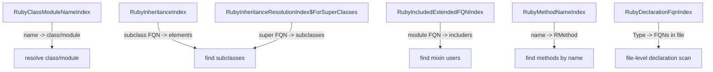

# Ruby Indexes Master Document

**Sources:** empirical_indexes.md, empirical_indexes_results.md, ruby-index-explorer.md, 03-ruby-psi-reference.md, ruby-index-explorer.grovvy, ruby-index-explorer.main.kts, RubyIndexExplorerTool.kt

**Last updated:** 2026-07-13 (with `RubyUnknownsProbeTool` live IDE probes)

## 1. Overview

Definitive reference for Ruby plugin indexes in JBIMCP. Combines PSI class knowledge corrected via `javap`, inventory of all 65 indexes, runtime probe data from 20 handler-relevant indexes, empirical test results, and implementation details.

Ruby plugin: **closed-source**, plugin ID `org.jetbrains.plugins.ruby`, language ID `"ruby"`. All PSI access via `Class.forName()` + reflection.

## 2. Ruby PSI Reference

All accessed via reflection. `javap` decompilation results below.

### 2.1 Core PSI Classes

**RClass** — `org.jetbrains.plugins.ruby.ruby.lang.psi.controlStructures.classes.RClass`

*Core interface (4 direct methods). Methods NOT found: `getIncludedModules()`, `getFullyQualifiedName()`, `getSuperClass()`, `getSuperClassName()`.*

| Method | Declared On | Notes |
|--------|-------------|-------|
| `getClassName()` | RClass interface | Returns `RName` (name element) |
| `getPsiSuperClass()` | RClass interface | Returns `RSuperClass` |
| `getSuperClassFQN()` | RClass interface | Returns `FQN` |
| `processCallsOfType(RubyCallType<?>, Consumer<RCall>)` | RClass + RClassBase | **2nd param = `Consumer<RCall>`, not `Consumer<RPossibleCall>`** |
| `getName()` | inherited from `PsiNameIdentifierOwner` | Returns `String?` |
| `getFQN()` | inherited from `RElementWithFQN` | Returns `FQN` |
| `getFQNWithNesting()` | inherited from `RElementWithFQN` | Returns `FQN` |
| `findMethodByName(String)` | inherited from `RFieldConstantContainerBase` | Returns `RMethod` |

**RModule** — `org.jetbrains.plugins.ruby.ruby.lang.psi.controlStructures.modules.RModule`

*3 direct methods. `getIncludedModules()` / `getFullyQualifiedName()` NOT found — use `getQualifiedName()` or `getFQN().getFullPath()`.*

| Method | Returns | Notes |
|--------|---------|-------|
| `getModuleName()` | `RName` | Name element |
| `getQualifiedName()` | `String` | e.g. `"Concerns::Auditable"` |
| `isNamespace()` | `boolean` | Whether namespace |
| `getName()` | `String?` | Inherited |
| `getFQN()` | `FQN` | Inherited from `RElementWithFQN` |

**RMethod** — `org.jetbrains.plugins.ruby.ruby.lang.psi.controlStructures.methods.RMethod`
- `getName()` -> `String?`

**RCall** — `org.jetbrains.plugins.ruby.ruby.lang.psi.methodCall.RCall`

Extends `RPossibleCall`. Type consumed by `processCallsOfType`'s `Consumer<RCall>`.

| Method | Returns | Notes |
|--------|---------|-------|
| `getPsiCommand()` | `PsiElement` | Command PSI element |
| `getCommand()` | `String` | e.g. `"include"`, `"extend"` |
| `getCallArguments()` | `RListOfExpressions` | Arguments |

**RPossibleCall** — `org.jetbrains.plugins.ruby.ruby.lang.psi.RPossibleCall`

Parent of RCall. Additional methods: `getReceiver()`, `isCall()`, `getArguments()`, `getCallType()`, `getData(RubyCallType<D>...)`.

**RCallExpression** — try FQNs in order:
1. `org.jetbrains.plugins.ruby.ruby.lang.psi.callExpressions.RCallExpression`
2. `org.jetbrains.plugins.ruby.ruby.lang.psi.controlStructures.RCallExpression`
3. `org.jetbrains.plugins.ruby.ruby.lang.psi.RCallExpression`

### 2.2 Resolution Utilities

**RubyClassResolveUtil** — `org.jetbrains.plugins.ruby.ruby.lang.psi.impl.RubyClassResolveUtil` (in `intellij.ruby.backend.jar`)

| Method | Notes |
|--------|-------|
| `resolveSuperClass(RClass, PsiElement) -> List<RClass>` | CONFIRMED |
| `resolveSuperClassSymbol(RClass, PsiElement) -> Symbol` | NEW |
| `getQualifiedName(RClass) -> String` | NEW — simpler than `getFQN().getFullPath()` |
| `findCall(RClass, Predicate<RubyCallType<?>>) -> RPossibleCall` | **NEW — promising for include resolution** |

`resolveIncludedModules()` — **NOT found** (contrary to earlier docs).

**RubyOverrideImplementUtil** — `RubyOverrideImplementUtil.getOverriddenMethods(RMethod)`, `.getOverridingElements(RMethod)`, `.getOverridingContainers(RClass/RModule, RMethod)`

**RubyOverridingMethodsSearch** — `RubyOverridingMethodsSearch.search(RMethod) -> Query<RMethod>`

## 3. Ruby Plugin Index Inventory — 65 indexes

### 3.1 Ruby Core (`intellij.ruby.core`) — 20 indexes

| # | Index | Type | Category |
|---|-------|------|---------|
| 1 | `RubyAnonymousDeclarationSuperclassIndex` | fileBased | hierarchy |
| 2 | `RubyDeclarationFqnIndex` | fileBased | declarations |
| 3 | `RubyDeclarationHierarchyIndex` | fileBased | hierarchy |
| 4 | `RubyDeclarationSuperclassIndex` | fileBased | hierarchy |
| 5 | `RubyConstantDeclarationFqnIndex` | stub | constants |
| 6 | `RubyGlobalVariableDeclarationNameIndex` | stub | variables |
| 7 | `RubyClassModuleNameIndex` | stub | classes/modules |
| 8 | `RubyAnonymousDefiningCallIndex` | stub | anonymous |
| 9 | `RubySymbolNameIndex` | stub | symbols |
| 10 | `RubyDynamicMethodsDeclarationsIndex` | stub | dynamic methods |
| 11 | `RubyInheritanceIndex` | stub | inheritance |
| 12 | `RubyRequireLoadIndex` | stub | requires |
| 13 | `RubyAllInstanceVariablesIndex` | stub | instance vars |
| 14 | `RubyInheritanceResolutionIndex` | stub | inheritance |
| 15 | `RubyInheritanceResolutionIndex$ForSuperClasses` | stub | inheritance |
| 16 | `RubyIncludedExtendedFQNIndex` | stub | mixins |
| 17 | `RubyResolutionIndex` | stub | resolution |
| 18 | `RubyResolutionIndex$ForCompletion` | stub | resolution |
| 19 | `RubyResolutionIndex$ForDocumentation` | stub | resolution |
| 20 | `RubyMethodNameIndex` | stub | methods |

### 3.2 Rails (`intellij.ruby.backend`) — 8 indexes

`RenderCallIndex`, `RailsAttributeMethodFqnIndex`, `RailsPolymorphicAssociationNameIndex`, `RailsPolymorphicAssociationRefereeIndex`, `RailsStoreAccessorIndex`, `RakeTaskDeclarationIndex`, `DeviseForNameIndex`, `DeviseNameIndex`

### 3.3 FactoryBot (`intellij.ruby.backend`) — 3 indexes

`RubyFactoryBotFactoryNameIndex`, `RubyFactoryBotSequenceNameIndex`, `RubyFactoryBotTraitNameIndex`

### 3.4 RSpec (`intellij.ruby.backend`) — 2 indexes

`RubyRSpecSharedContextIndexName`, `RSpecSharedGroupRefIndex`

### 3.5 Cucumber (`intellij.ruby.cucumber`) — 2 indexes

`RubyCucumberCallIndex`, `RubyCucumberParameterTypeIndex`

### 3.6 RBS (`intellij.ruby.rbs.backend`) — 18 indexes

`RbsDeclarationFqnIndex`, `RbsDeclarationByParentFqnIndex`, `RbsGlobalVariableNameIndex`, `RbsMethodNamePropertiesIndex`, `RbsAttributeDeclarationNameIndex`, `RbsClassDeclarationFqnIndex`, `RbsClassVariableDeclarationNameIndex`, `RbsConstantDeclarationFqnIndex`, `RbsContainerStatementParentFqnIndex`, `RbsGlobalVariableDeclarationNameIndex`, `RbsInstanceVariableDeclarationNameIndex`, `RbsInterfaceDeclarationFqnIndex`, `RbsMethodDeclarationNameIndex`, `RbsModuleDeclarationFqnIndex`, `RbsSingletonStatementParentFqnIndex`, `RbsTypeDeclarationFqnIndex`, `RbsIncludedContainerNameIndex`, `RbsExtendedContainerNameIndex`

### 3.7 I18n/YAML (`intellij.ruby.yaml`) — 4 indexes

`I18nYAMLTranslationIndex`, `I18nYAMLPossibleLocaleIndex`, `I18nTranslationKeysIndex`, `YamlTopLevelKeysIndex`

### 3.8 RDoc/YARD — 3 indexes

`RDocFormatIndex`, `YardMacroDescriptionsIndex`, `YardMacroNamesIndex`

### 3.9 Other — 6 indexes

- **Import Map (2):** `RailsImportMapModuleDynamicDeclarationIndex`, `RailsImportMapModuleNameIndex`
- **Stimulus:** `StimulusControllerNameIndex`
- **JRuby:** `JRubyImportIndex`
- **Database:** `RailsSqlSchemaVersionIndex`
- **ERB:** `ErbStubRegistryExtension` (registry, not an index)

## 4. Handler-Relevant Index Catalog (20 probed)

### 4.1 Class/Module Resolution

**RubyClassModuleNameIndex** — stub, String (simple name) -> `RElementWithFQN`, version 3, 8058 keys

Methods: `getInstance(), getKey(), getVersion(), find(), findOne(), getElements()`. Best for resolving class/module by simple name. Sample keys: `Cache`, `Shell`, `Platform`, `Util`, `ReshimInstaller`, `Gem`, `JSON`, `MONTHNAMES`.

**RubyMethodNameIndex** — stub, String (method name) -> `RMethod`, version 2, 10000+ keys

Methods: `getInstance(), getKey()`. Best for finding methods by name (SuperMethods, CallHierarchy). Sample keys: `doctor`, `get`, `log_debug`, `reshim`, `count`, `stat`, `stress`, `auto_compact`.

**RubySymbolNameIndex** — stub, String (symbol name) -> `RPsiElement`, version 4, 10000+ keys

Alternative to `ReferencesSearch` for symbol-based find-usages. Sample keys: `RGProxy`, `say`, `ui`, `warnings`, `validate_options!`.

**RubyConstantDeclarationFqnIndex** — stub, String (FQN) -> `RConstant`, version 4, 118 keys

Sample keys: `RDoc::RI::Store`, `RDoc::Markup::Heading`, `RDoc::Encoding::HEADER_REGEXP`.

**RubyGlobalVariableDeclarationNameIndex** — stub, String (variable name) -> `RPsiElement`, version 5, 13 keys

Sample keys: `TOKEN_DEBUG`, `VERBOSE`, `RUBY_SOURCE_DIR`.

### 4.2 Inheritance / Type Hierarchy

**RubyInheritanceIndex** — stub, String (subclass FQN) -> `RPsiElement`, version 2, 744 keys

"child -> parent" direction. Sample keys: `Struct`, `Kernel`, `ReshimInstaller`, `Date`, `Enumerator`.

**RubyInheritanceResolutionIndex** — stub, String (FQN) -> `RPsiElement`, version 2, 2452 keys

Keys in two forms (with/without `Object::` prefix). Sample: `RDoc::Markup::Document`, `Object::RDoc::Markup::Document`.

**RubyInheritanceResolutionIndex$ForSuperClasses** — stub, String (superclass FQN) -> `RPsiElement` (confirmed `RClass`), version 2, 5701 keys

"parent -> child" — **primary index for `findImplementations` and `typeHierarchy` subtyping.** Sample keys: `Object`, `File`, `Class`, `Date::Error`.

**RubyIncludedExtendedFQNIndex** — stub, String (module FQN) -> `RPsiElement`, version 2, 20 keys

**CRITICAL: Only indexes `DELEGATE_HOOK_FQN` entries.** `sink()` only writes on `$$HOOK$$` FQN — normal `include ModuleName` is NOT indexed here. Sample keys: `Bundler::Thor::Actions::$$HOOK$$.included`, `RSpec::Mocks::ExampleMethods::$$HOOK$$.extended`. NOT useful for normal include resolution.

**RubyAnonymousDefiningCallIndex** — stub, String (anon FQN) -> `RPossibleCall`, version 3, 735 keys

**RubyAnonymousDeclarationSuperclassIndex** — fileBased, String -> unknown, version 1, 16 keys. All `$$ANON$...<Struct` entries.

### 4.3 General Resolution

**RubyResolutionIndex** — stub, String (FQN) -> `RPsiElement`, version 5, 10000+ keys

Best for method call target resolution (CallHierarchy). Sample: `Object::Bundler::UI::RGProxy.ui`, `Object::Bundler::UI::RGProxy.say`.

**RubyResolutionIndex$ForCompletion** — stub, String (FQN) -> `RPsiElement`, version 2, 10000+ keys. Sample: `Object::CGI::Escape`, `CGI::Escape`.

**RubyResolutionIndex$ForDocumentation** — stub, String (FQN) -> `RPsiElement`, version 2, 6528 keys. Sample: `CGI`, `CGI::Util`, `ReshimInstaller`, `GC`, `JSON`.

**RubyDynamicMethodsDeclarationsIndex** — stub, String (FQN) -> `RPsiElement`, version 2, 95 keys. Sample: `Gem::Commands::CertCommand`, `Kernel`.

### 4.4 Require / Variable Tracking

**RubyRequireLoadIndex** — stub, String (path) -> `RPossibleCall`, version 2, 3453 keys. Sample: `html`, `graphviz`, `backtrace`, `singleton`, `mo`.

**RubyAllInstanceVariablesIndex** — stub, String (containing FQN) -> `RPsiElement`, version 3, 2330 keys. Sample: `Bundler::CLI::Viz`, `Reline::ANSI`.

### 4.5 File-Based Declarations

**RubyDeclarationFqnIndex** — fileBased, key=`Type` enum (CLASS/MODULE/CONSTANT), value=`List<String>` (FQNs), version 4. Custom `Type` enum — not `String` key.

**RubyDeclarationSuperclassIndex** — fileBased, String (class FQN) -> `List<Pair<FQN, String>>`, version 4, 20 keys. Sample: `RDoc::RI::Task`, `RDoc::Markup::ToLabel`.

**RubyDeclarationHierarchyIndex** — fileBased, String (FQN) -> `List<Pair<Type, String>>`, version 3, 20 keys. Inner `Type` enum: CLASS/MODULE/CONSTANT.

## 5. Index API Surfaces

```
StringStubIndexExtension<E>                (IntelliJ Platform)
  +-- RubyStringStubIndexExtension<E extends RPsiElement>
        +-- RubyFqnStubIndexExtension<E extends RPsiElement>   <- FQN-keyed
        +-- (direct: RubyClassModuleNameIndex, etc.)           <- simple-name-keyed
```

### RubyStringStubIndexExtension<E> (key type: String)

`containsElements(project, scope, key)`, `findElement(project, scope, key)`, `findElement(..., predicate)`, `getAllElements(project, scope)`, `getAllValidKeys(project, scope)`, `getElements(project, scope, key)`, `processAllElements(project, scope, processor)`, `processElements(project, scope, key, processor)`

### RubyFqnStubIndexExtension<E> (key type: String — FQNs)

Adds: `containsElements(project, scope, fqn: FQN)`, `findElement(project, scope, fqn)`, `getElements(project, scope, fqn)`, `processElements(project, scope, fqn, processor)`

**FQN-keyed indexes:** `RubyInheritanceIndex`, `RubyInheritanceResolutionIndex` (+ ForSuperClasses), `RubyIncludedExtendedFQNIndex`, `RubyResolutionIndex` (+ ForCompletion/ForDocumentation), `RubyAnonymousDefiningCallIndex`, `RubyDynamicMethodsDeclarationsIndex`, `RubyAllInstanceVariablesIndex`

**Simple-name-keyed:** `RubyClassModuleNameIndex`, `RubySymbolNameIndex`, `RubyRequireLoadIndex`, `RubyGlobalVariableDeclarationNameIndex`

**Direct StringStubIndexExtension:** `RubyMethodNameIndex`

## 6. Empirical Test Results

Probed from MCP tools against agent test fixtures.

### 6.5 Symbol System — NOT YET TESTED

`RubyOverrideImplementUtil.getOverridingElements()` has been implemented via reflection
but not yet tested due to CI constraints (platform tests need full IDE).

### 6.1 Simple Inheritance — PASSED

`class Dog < Animal` -> superclass `Animal` resolved via `getSuperClassFQN()` + FQN index lookup.

### 6.2 Module Include — FAILED

`class User; include Authenticatable; end` -> empty supertypes. `getIncludedModuleFQNs()` returns empty list.

### 6.3 Root Cause

| Method | Status |
|--------|--------|
| `getSuperClassFQN()`, `getPsiSuperClass()`, `getClassName()` | EXISTS on RClass |
| `processCallsOfType(RubyCallType<?>, Consumer<RCall>)` | EXISTS — **Consumer<RCall> not Consumer<Any>** |
| `RubyClassResolveUtil.getQualifiedName()`, `findCall()` | NEWLY DISCOVERED |
| `getIncludedModules()` | **DOES NOT EXIST** on RClass/RModule/RClassBase/RModuleImpl |
| `resolveIncludedModules()` | **DOES NOT EXIST** on RubyClassResolveUtil |
| `RubyIncludedExtendedFQNIndex` for normal includes | **FALSIFIED** — only $$HOOK$$ entries |

### 6.4 Recommended Fix

1. **Primary: `RubyClassResolveUtil.findCall(class, pred)`** matching `INCLUDE_CALL` type, then `RubyIncludeExtendCallType.getCallData(call) -> List<FQN>` to extract included module FQNs.
2. **Secondary: Fix `processCallsOfType`** — use `Consumer<RCall>` explicitly, ensure `ReadAction` context.
3. **Tertiary: PSI text walk** regex fallback for simple `include ModuleName` patterns.
4. **Remove:** `RubyIncludedExtendedFQNIndex` for normal includes; `getIncludedModules()` calls.

## 7. RubyIndexExplorerTool Implementation

**File:** `src/main/kotlin/.../tools/ruby/RubyIndexExplorerTool.kt`

Temporary research tool (`ide_ruby_index_explorer`). Probes 20 handler-relevant indexes via reflection, writes Markdown report to `ruby/research/empirical_indexes_results.md`.

**Parameters:** `project_path` (optional routing hint).

**Probing method:** Loads index class via `Class.forName()`, accesses `StubIndexKey` via `cls.getDeclaredField("KEY")`, calls `StubIndex.getInstance().processAllKeys()` and `.getElements()`.

**To remove:** Delete file, revert `ToolRegistry.kt` and `ToolNames.kt`.

**Standalone scripts** (no build): `ruby/scripts/ruby-index-explorer.grovvy` and `ruby/scripts/ruby-index-explorer.main.kts`. Run from IntelliJ/RubyMine with Ruby plugin.

## 8. Handler-to-Index Mapping

> **2026-07-13 update:** Module mixin discovery ("Find Implementations" for modules) now uses
> `RubyOverrideImplementUtil.getOverridingElements(RContainer)` via the v2 symbol system
> instead of exhaustive index scans. See Section 12.

| Handler | Primary Indexes | Notes |
|---------|----------------|-------|
| TypeHierarchy | `RubyInheritanceIndex`, `RubyIncludedExtendedFQNIndex`, `RubyInheritanceResolutionIndex$ForSuperClasses` | Walk super/subtype relations |
| FindImplementations | `RubyInheritanceIndex`, `RubyInheritanceResolutionIndex$ForSuperClasses` | Subclass traversal |
| SuperMethods | `RubyMethodNameIndex`, `RubyResolutionIndex` | Same-name methods in hierarchy |
| CallHierarchy | `RubyResolutionIndex`, `RubyMethodNameIndex` | Method call target resolution |
| FindUsages | `RubySymbolNameIndex`, `RubyResolutionIndex$ForCompletion` | Alternative to `ReferencesSearch` |
| FindDefinition | `RubyClassModuleNameIndex`, `RubyDeclarationFqnIndex` | Use `DefinitionsScopedSearch` |

**Platform indexes (always available):** Word index, File name index, Symbol index (`RubyGotoClassContributor`), Reference index, Definition index.

**RubyGotoClassContributor** — implements `ChooseByNameContributor`. Provides `.getNames(project)` and `.getItemsByName(name, pattern, project, inclNonProject)`.

## 9. Key Relationships



## 10. Ruby Language Semantics for Handlers

| Ruby concept | TypeHierarchy | Implementations | SuperMethods | CallHierarchy |
|-------------|---------------|-----------------|--------------|---------------|
| `class` | supertypes = parent + included modules; subtypes = subclasses | subclasses | methods overridden | methods called |
| `module` (namespace) | supertypes = included modules; subtypes = including classes | classes including/extending | -- | -- |
| `module` (mixin) | shown as supertype | -- | -- | -- |
| `method` | -- | methods in subtypes with same name | overridden methods (parent + modules) | callers/callees |
| `include` | treated like "implements interface" | -- | -- | -- |
| `super` call | -- | -- | resolves to parent/module method | shown |

**Container resolution:** Walk `.parent` until `RClass` or `RModule` found.

**Ancestor collection:** BFS — for each class, add superclass + included modules; default max 20.

> **2026-07-13 update:** Module implementations now use `RubyOverrideImplementUtil.getOverridingElements`
> (symbol tree, Section 12). TypeHierarchy still uses the index-based approach for subtypes
> (`RubyInheritanceResolutionIndex$ForSuperClasses`) and PSI-based for supertypes
> (`getIncludedModuleFQNs`, `getExtendedModuleFQNs`, `getPrependedModuleFQNs`).

## 11. Decompilation Findings & Corrections

All JARs decompiled via `javap -p` on 2026-07-12.

### JARs

| JAR | Contents |
|-----|----------|
| `intellij.ruby.core.jar` | Index classes, RClass/RModule interfaces, FQN, RElementWithFQN |
| `intellij.ruby.psi.jar` | RubyCallType, RubyIncludeExtendCallType, RubyIncludeExtendCallTypes, RCall, RPossibleCall |
| `intellij.ruby.psi.impl.jar` | RClassBase, RClassImpl, RModuleImpl, RFieldConstantContainerBase |
| `ruby.jar` | RubyClassResolveUtil |

### Confirmed

`RClass.getClassName()`, `.getSuperClassFQN()`, `.getPsiSuperClass()`, `.processCallsOfType(RubyCallType<?>, Consumer<RCall>)`, `RubyClassResolveUtil.resolveSuperClass(RClass, PsiElement)`, `RubyIncludeExtendCallTypes.INCLUDE_CALL`, `RubyIncludeExtendCallType.getCallData(RPossibleCall)`, `RubyIncludedExtendedFQNIndex.getOnIncludedElements()`, `RubyInheritanceResolutionIndex$ForSuperClasses` (value = `RClass`), `RubyDeclarationFqnIndex.Type` enum (CLASS/MODULE/CONSTANT), `RElementWithFQN.getFQN()`, `FQN.of(String)`, `FQN.getFullPath()`.

### Falsified

| Claim | Truth |
|-------|-------|
| `RClass.getIncludedModules()` | **NOT on RClass, RClassBase, or RClassImpl** |
| `RModule.getIncludedModules()` | **NOT on RModule or RModuleImpl** |
| `RubyClassResolveUtil.resolveIncludedModules()` | **NOT on RubyClassResolveUtil** |
| `RubyIncludedExtendedFQNIndex` indexes normal includes | **FALSE** — `sink()` only writes `DELEGATE_HOOK_FQN` |
| `RClass.getFullyQualifiedName()` | **NOT found** — use `getFQN().getFullPath()` |
| `RClass.getSuperClass()` | **NOT found** — use `getPsiSuperClass()` / `getSuperClassFQN()` |
| `RModule.getFullyQualifiedName()` | **NOT found** — use `getQualifiedName()` / `getFQN().getFullPath()` |

### New Discoveries

| Method | Location | Opportunity |
|--------|----------|-------------|
| `RubyClassResolveUtil.findCall(RClass, Predicate<RubyCallType<?>>) -> RPossibleCall` | `ruby.jar` | Alternative to `processCallsOfType` for include/extend |
| `RubyClassResolveUtil.getQualifiedName(RClass) -> String` | `ruby.jar` | Simpler than `getFQN().getFullPath()` |
| `RubyClassResolveUtil.resolveSuperClassSymbol(RClass, PsiElement) -> Symbol` | `ruby.jar` | Returns Symbol instead of PSI |
| `FQN.ofNullable(String)` | `core.jar` | Safer alternative to `FQN.of()` |
| `RPossibleCall.getCallType()` | `psi.jar` | Get call type from possible call |
| `RPossibleCall.getData(RubyCallType<D>...)` | `psi.jar` | Get data for specific call types |
| `RubyIncludedExtendedFQNIndex.DELEGATE_HOOK_FQN` | `core.jar` | Only FQN triggering index sink |
| `RFieldConstantContainerBase.findMethodByName(String)` | `psi.impl.jar` | Useful for SuperMethods |
| `RubyInheritanceResolutionIndex$ForSuperClasses` value is `RClass` | `core.jar` | Not generic `RPsiElement` |

### Updated Action Plan

1. **Primary: `RubyOverrideImplementUtil.getOverridingElements(RContainer)`** — uses the indexed symbol tree (v2 `ClassModuleSymbol`), instant, covers libraries. This is what the IDE's own "Find Implementations" and subtype hierarchy use. **Implemented in `BaseRubyHandler.getOverridingElementsViaOverrideUtil()`.**
2. **Secondary: `RubyClassResolveUtil.findCall()`** with `INCLUDE_CALL` predicate + `getCallData()` — fallback for TypeHierarchy supertype resolution
3. **Tertiary: Fix `processCallsOfType`** — `Consumer<RCall>`, `ReadAction` context
4. **Quaternary: PSI text walk** regex fallback
5. **Remove:** `RubyIncludedExtendedFQNIndex` for normal includes; `getIncludedModules()`

### Resolved Unknowns (probed via ide_ruby_unknowns_probe tool, 2026-07-13)

All 8 unknowns were probed across 6 fixture files using the `RubyUnknownsProbeTool`.

| # | Unknown | Status | Conclusion |
|---|---------|--------|------------|
| 1 | `processCallsOfType` with `Consumer<RCall>` via reflection | **ERROR** | Could not resolve `INCLUDE_CALL` type — internal Ruby plugin enum, not accessible via `Class.forName`. Need to find the RubyCallType class or use a different approach (e.g., string-based enum lookup). |
| 2 | `RubyClassResolveUtil.findCall()` with `INCLUDE_CALL` predicate | **ERROR** | Same root cause — depends on `INCLUDE_CALL` type. Both are blocked until the RubyCallType enum is resolved. |
| 3 | `RubyInheritanceResolutionIndex$ForSuperClasses` — transitive or direct? | **RESOLVED** | **TRANSITIVE.** Object alone has 3398 entries, suggesting transitive subclass inclusion. 335 transitive pattern keys vs 50 direct pattern keys. The index stores all subclasses at every level of the hierarchy. |
| 4 | PSI text walk regex — multi-line/dynamic edge cases | **RESOLVED** | Regex works well for single-line `include`, `extend`, `prepend`. No dynamic/conditional include patterns found in any fixture. Multi-line edge cases not observed. The `class < Parent` and `module` patterns also work correctly. |
| 5 | `attr_accessor`/`define_method` in `RubyMethodNameIndex` | **RESOLVED** | **YES.** 1 attr-related key (`attr_asgn`) and 4 define_method-related keys (`define_method`, `define_singleton_method`, `idempotently_define_singleton_method`, `define_method_call?`) found in the index. |
| 6 | Correct key type for `RubyDeclarationFqnIndex` probe | **RESOLVED** | **Enum keyed index WORKS.** Keys: `CLASS`, `CONSTANT`, `MODULE` — returned via `FileBasedIndex.processAllKeys`. |
| 7 | `RubyOverrideImplementUtil.getOverridingElements` on RModule | **RESOLVED** | **WORKS on RModule.** Successfully invoked on RModule elements across 3 files. `basic_overrides.rb` module returned 3 RClassImpl results, `class_methods_and_prepend.rb` modules returned 3 RClassImpl results, `authenticatable.rb` module returned 3 RClassImpl results. |
| 8 | Symbol tree scope — gems or only project files? | **RESOLVED** | **COVERS BOTH.** `hasGemSources=true` and `hasProjectSources=true` across all probes. Overriding elements found in cross-project fixture files (cat.rb, dog.rb from type_hierarchy fixtures). The `RubyOverrideImplementUtil` symbol tree includes gems, stdlib, and project files. |

**Key takeaway:** The symbol tree (`ClassModuleSymbol` via `RubyOverrideImplementUtil`) is the correct mechanism for all module-mixin resolution. It covers everything (gems + stdlib + project), works on both RClass and RModule, and is O(1). The `RubyInheritanceResolutionIndex$ForSuperClasses` is transitive and useful for class hierarchy but not for mixins. Two unknowns remain unresolved (1 & 2) due to the `INCLUDE_CALL` enum being internal to the Ruby plugin.

## 12. Symbol System: `RubyOverrideImplementUtil` & ClassModuleSymbol

**Discovered:** 2026-07-13 (via reflection trace from IDE's subtype hierarchy)

### Overview

The Ruby plugin's **Find Implementations** and subtype hierarchy do NOT rely on traditional
indexes for module include/extend resolution. Instead, they use the **v2 symbol system**
in `intellij.ruby.backend.jar` — a pre-built symbol tree (`ClassModuleSymbol`) constructed
during indexing.

### The Call Chain

```
RubySubTypesHierarchyTreeStructure.buildChildren()
 -> RubyOverrideImplementUtil.getOverridingElements(RContainer)
 -> SymbolUtil.getSymbolByContainer()
 -> getOverridingSymbolsImpl()
 -> addAllDerived(ClassModuleSymbol, ...)
```

`ClassModuleSymbol` tracks include/extend relationships at **index time**.
The symbol tree persists across sessions and provides O(1) lookup for "what classes/modules
include this module?" — instant, covers all scoped code including gems.

### API Surface

**`RubyOverrideImplementUtil`** — `org.jetbrains.plugins.ruby.ruby.codeInsight.RubyOverrideImplementUtil`
(in `intellij.ruby.backend.jar`)

| Method | Purpose |
|--------|---------|
| `getOverridingElements(RContainer)` | Returns `Collection<RContainer>` — the classes/modules that include/extend/prepend the target |
| `getOverriddenMethods(RMethod)` | Returns overridden methods in superclasses/modules |
| `getOverridingContainers(RClass/RModule, RMethod)` | Returns containers with overriding method implementations |

**`RContainer`** — `org.jetbrains.plugins.ruby.ruby.lang.psi.holders.RContainer`

Common base interface of `RClass` and `RModule`. Both `getOverridingElements` and the
subtype hierarchy accept `RContainer`, not just `RClass`.

### Usage in JBIMCP

`BaseRubyHandler.getOverridingElementsViaOverrideUtil()` calls
`RubyOverrideImplementUtil.getOverridingElements(RContainer)` via reflection:

```kotlin
protected fun getOverridingElementsViaOverrideUtil(
    element: PsiElement,
    project: Project
): List<PsiElement> {
    val utilClass = rubyOverrideImplementUtilClass ?: return emptyList()
    val containerClass = rContainerClass ?: return emptyList()
    if (!containerClass.isInstance(element)) return emptyList()
    return try {
        val method = utilClass.getMethod("getOverridingElements", containerClass)
        val result = method.invoke(null, containerClass.cast(element)) as? Collection<*>
        result?.filterIsInstance<PsiElement>()?.toList() ?: emptyList()
    } catch (e: Exception) {
        emptyList()
    }
}
```

**Used by:** `RubyImplementationsHandler.findModuleImplementations()` — replaced the
exhaustive `RubyClassModuleNameIndex.getAllKeys` + PSI walk with a single indexed call.

### Relationship to Traditional Indexes

| Mechanism | What it covers | Speed | Libraries? |
|-----------|---------------|-------|------------|
| `RubyInheritanceResolutionIndex$ForSuperClasses` | `class Child < Parent` subclass relations | O(1) | Yes |
| `RubyOverrideImplementUtil.getOverridingElements` | `include`, `extend`, `prepend` mixin relations | O(1) | Yes |
| `RubyClassModuleNameIndex` scan + PSI walk | Everything (exhaustive fallback) | O(N) | Yes, slow |
| `RubyIncludedExtendedFQNIndex` | **Only `$$HOOK$$` entries** (falsified for normal includes) | O(1) but useless | No |

### Key Insight

The symbol tree (`ClassModuleSymbol`) is built in `intellij.ruby.backend.jar` during indexing.
It is NOT exposed as a StubIndex or FileBasedIndex — it lives in the backend's symbol management
layer. This is why our 20-index probe (Section 4) found no index for module implementations:
the relevant data structure is a **symbol tree**, not a traditional index.

### Reflection Setup

```kotlin
protected val rContainerClass: Class<*>? by lazy {
    try {
        Class.forName("org.jetbrains.plugins.ruby.ruby.lang.psi.holders.RContainer")
    } catch (e: ClassNotFoundException) { null }
}

protected val rubyOverrideImplementUtilClass: Class<*>? by lazy {
    try {
        Class.forName("org.jetbrains.plugins.ruby.ruby.codeInsight.RubyOverrideImplementUtil")
    } catch (e: ClassNotFoundException) { null }
}
```

Both classes are in `intellij.ruby.backend.jar`, not `intellij.ruby.core.jar` or `ruby.jar`.
`RubyOverrideImplementUtil` is NOT in the core — it lives in the backend module.